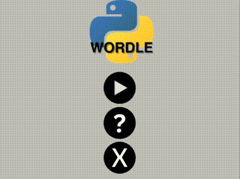

# Pygame Wordle 

This is a remake of Wordle using the python pygame library.

## Demo

## Requirements

 - [Pygame Library](https://pyga.me/)
 - [API Ninjas API key](https://api-ninjas.com/)

Asign your API Ninjas API key to the variable "API_KEY".
## License

[MIT](https://choosealicense.com/licenses/mit/)

